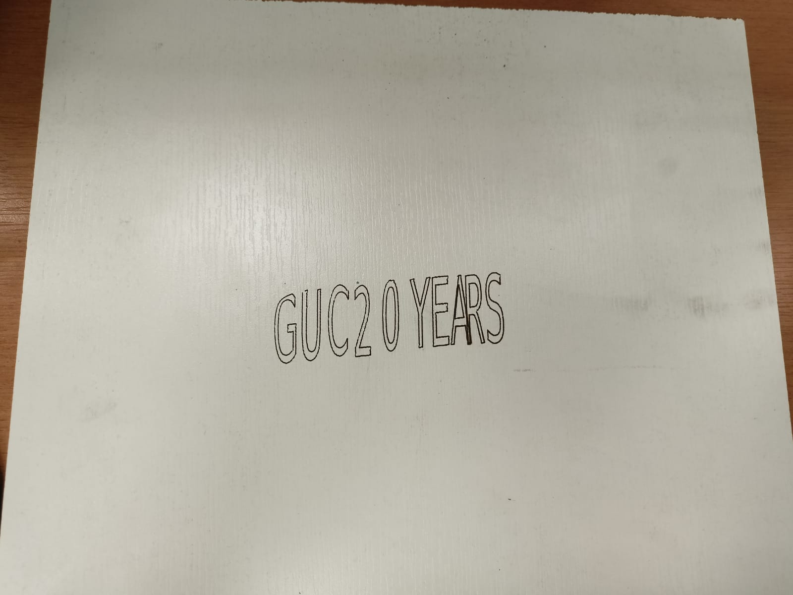

# 4-DOF SCARA Robot for Laser Engraving

## Overview
This repository contains the design, control, and simulation files for a 4-DOF SCARA robot used for laser engraving. The project includes:
- **Mathematical modeling** (kinematics and dynamics) using MATLAB/Simulink.
- **Control algorithms** implemented via Marlin firmware on an Arduino Mega.
- **3D design files** (SolidWorks) for robot assembly.
- **Experimental results** showcasing laser engraving capabilities.

## Features
- **4 Degrees of Freedom**: Three rotational joints (X-Y plane) and one vertical prismatic joint (Z-axis).
- **Laser Engraving**: Custom end-effector for precise engraving on workpieces.
- **Inverse Kinematics**: Geometric and algebraic solutions for path planning.
- **Open-Source Control**: Marlin firmware configured for SCARA kinematics.
- **Modular Design**: Easily replaceable end-effectors for diverse applications.

## Repository Structure
SCARA-Robot-Laser-Engraving/  
├── SCARA MODEL/ # 3D models and assembly files  
├── MATLAB_Simulations/ # Forward/inverse kinematics and dynamics  
├── Control/Marlin-2.0.x/ # Marlin configuration and motor test codes  
├── Videos/ # Images and data from engraving tests  
└── Thesis/ # Thesis PDF and supplementary notes  

## Key Components
- **Hardware**:
  - NEMA 17 stepper motors (4x).
  - GT2 belts and pulleys for joint actuation.
  - 12V laser module (PWM-controlled).
  - Limit switches for homing.
- **Software**:
  - MATLAB/Simulink for simulation.
  - Marlin firmware (customized for SCARA).
  - Repetier-Host for G-code execution.
  - Inkscape + LaserTools plugin for G-code generation.

## Setup Instructions
1. **Assembly**:
   - 3D-print parts from `SolidWorks_Designs/`.
   - Assemble belts, pulleys, and motors as per the thesis (Chapter 5).
2. **Electronics**:
   - Connect steppers, limit switches, and laser to Arduino Mega/RAMPS 1.6.
   - Adjust stepper driver currents using `V_ref = I_mot * 8 * R_sense`.
3. **Firmware**:
   - Upload Marlin firmware (`Arduino_Firmware/`) with SCARA-specific settings:
     - Arm lengths: 228mm (Link 1), 136.5mm (Link 2).
     - Steps/unit: 90 (Joint 1), 29.206 (Joint 2), 400 (Z-axis).
4. **Calibration**:
   - Home the robot using limit switches.
   - Focus the laser at ~5cm height (adjust lens rotation).
5. **Operation**:
   - Generate G-code in Inkscape (vector paths → LaserTools plugin).
   - Execute via Repetier-Host.

## Results
- **Simulations**: Validated forward/inverse kinematics and dynamics (see `MATLAB_Simulations/`).
- **Engraving Tests**:
  - Contour shapes (e.g., squares, logos).
  - Text engraving (e.g., "GUC 20 YEARS").
  - Infill patterns (e.g., bat shape).  
  

## Future Work
- Integrate computer vision for real-time adjustments.
- Implement soft grippers for pick-and-place tasks.
- Enhance rigidity to reduce positional errors.

## References
- Thesis: *Four Degrees of Freedom SCARA Robot Used for Laser Engraving* (Marwan Sallam, 2022).
- [Marlin Firmware](https://marlinfw.org/)
- [Inkscape LaserTools](https://github.com/jncordon/lasertools)

## License
Open-source (MIT). Use freely for academic or personal projects.
